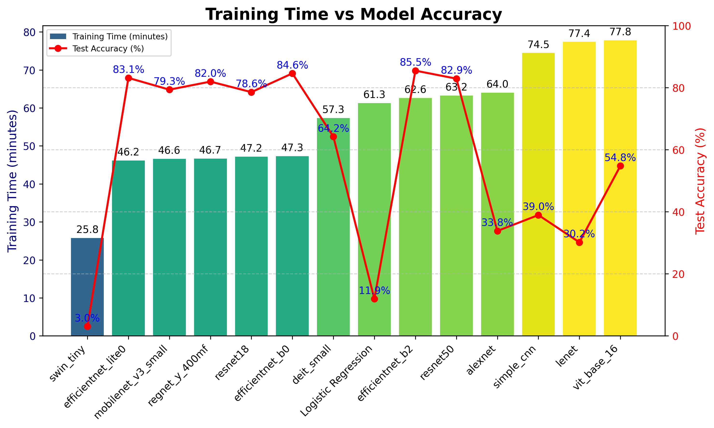

# Deep Learning Architecture Comparison on CIFAR-100

[](https://python.org)
[](https://pytorch.org)
[](LICENSE)
[](https://github.com/sudhanshumukherjeexx/deep-learning-architecture-comparison-on-CIFAR100/)

A comprehensive comparison of 14 deep learning architectures on the CIFAR-100 dataset, evaluating performance, efficiency, and training characteristics across traditional CNNs, modern architectures, Vision Transformers, and mobile-optimized models.



## 🎯 Overview

This project systematically evaluates 14 different neural network architectures on CIFAR-100, providing insights into:
- **Performance**: Test accuracy and convergence behavior
- **Efficiency**: Training time and parameter efficiency  
- **Generalization**: Overfitting analysis and stability metrics
- **Architecture Families**: Traditional CNNs, Modern CNNs, Vision Transformers, and Mobile Networks

## 📊 Key Results

**Best Performing Models:**
- 🥇 **EfficientNet-B2**: 85.48% accuracy
- 🥈 **EfficientNet-B0**: 84.60% accuracy  
- 🥉 **EfficientNet-Lite0**: 83.14% accuracy

**Most Parameter Efficient:**
- **MobileNet-V3-Small**: 48.97 accuracy points per million parameters
- **EfficientNet-Lite0**: 23.72 accuracy points per million parameters

## 🏗️ Architectures Evaluated

| Architecture Family | Models | Count |
|-------------------|---------|-------|
| **Traditional CNNs** | SimpleCNN, LeNet, AlexNet | 3 |
| **Modern CNNs** | ResNet18/50, RegNet-Y-400MF | 3 |
| **EfficientNets** | EfficientNet-B0/B2, EfficientNet-Lite0 | 3 |
| **Vision Transformers** | ViT-Base-16, DeiT-Small, Swin-Tiny | 3 |
| **Mobile Networks** | MobileNet-V3-Small | 1 |
| **Baseline** | Logistic Regression | 1 |

## 📈 Complete Results

| Model | Test Accuracy | Training Time (s) | Total Parameters | Trainable Parameters |
|-------|--------------|-------------------|------------------|---------------------|
| **EfficientNet-B2** | **85.48%** | 3,756.2 | 7,841,894 | 7,841,894 |
| **EfficientNet-B0** | **84.60%** | 2,838.8 | 4,135,648 | 4,135,648 |
| **EfficientNet-Lite0** | **83.14%** | 2,770.5 | 3,499,108 | 3,499,108 |
| ResNet-50 | 82.90% | 3,794.2 | 23,712,932 | 23,712,932 |
| RegNet-Y-400MF | 81.95% | 2,799.1 | 3,947,244 | 3,947,244 |
| MobileNet-V3-Small | 79.35% | 2,797.0 | 1,620,356 | 1,620,356 |
| ResNet-18 | 78.56% | 2,831.3 | 11,227,812 | 11,227,812 |
| DeiT-Small | 64.21% | 3,440.1 | 21,704,164 | 21,704,164 |
| ViT-Base-16 | 54.79% | 4,666.7 | 85,875,556 | 85,875,556 |
| SimpleCNN | 38.95% | 4,470.1 | 3,356,324 | 3,356,324 |
| AlexNet | 33.81% | 3,838.9 | 57,413,540 | 57,413,540 |
| LeNet | 30.16% | 4,643.1 | 5,414,936 | 5,414,936 |
| Logistic Regression | 11.90% | 3,677.2 | - | - |
| Swin-Tiny | 3.03% | 1,546.0 | 27,596,254 | 27,596,254 |

## 🚀 Quick Start

### Option 1: Google Colab (Recommended)

**1. Main Training Notebook**: [](https://colab.research.google.com/drive/1HOE4S02wwpklCUOOlRMEKAYOiDfCJDS8?usp=sharing)


**2. Data Visualization & Analysis**: [](https://colab.research.google.com/drive/1s-NgOQupEPD_HVcehcrejz8Y-SBjNRgs?usp=sharing)

### Option 2: Local Setup

```bash
# Clone repository
git clone https://github.com/sudhanshumukherjeexx/deep-learning-architecture-comparison-on-CIFAR100.git
cd deep-learning-architecture-comparison-on-CIFAR100

# Run the main notebook and then visualization notebook

```

## 📋 Requirements

- **Python**: 3.9+
- **PyTorch**: 2.6.0+cu124
- **CUDA**: Google Colab L4 GPU (recommended)

## 🔬 Methodology

### Training Configuration
- **Dataset**: CIFAR-100 (50K train, 10K test)
- **Image Size**: 224×224 (resized from 32×32)
- **Trainer Class**: Mixed precision training, early stopping, cosine LR scheduling, checkpointing, and auto-resume.
- **Early Stopping**: 5-epoch patience

### Evaluation Metrics
- **Test Accuracy**: Primary performance metric
- **Parameter Efficiency**: Accuracy per million parameters
- **Training Stability**: Variance in final training epochs
- **Generalization**: Train-test accuracy gap analysis


## 📁 Project Structure

```
├── notebooks/
│   ├── Comaprisons of Deep Learning Architectures on CIFAR-100.ipynb
│   └── Data Viz: Comaprisons of Deep Learning Architectures on CIFAR-100.ipynb
├── plots/
│   ├── training_vs_accuracy.png
│   ├── loss_curves/
│   └── analysis/
└── README.md
```

## 🤝 Contributing

Contributions welcome! Please feel free to submit pull requests for:
- Additional architectures
- Enhanced visualizations  
- Performance optimizations
- Documentation improvements

## 📄 License

This project is licensed under the MIT License - see the [LICENSE](LICENSE) file for details.

## 🔗 References

- **CIFAR-100**: [Learning Multiple Layers of Features from Tiny Images](https://www.cs.toronto.edu/~kriz/cifar.html)
- **EfficientNet**: [EfficientNet: Rethinking Model Scaling for Convolutional Neural Networks](https://arxiv.org/abs/1905.11946)
- **Vision Transformers**: [An Image is Worth 16x16 Words](https://arxiv.org/abs/2010.11929)
- **ResNet**: [Deep Residual Learning for Image Recognition](https://arxiv.org/abs/1512.03385)

---

**Built with ❤️ by sudhanshu**